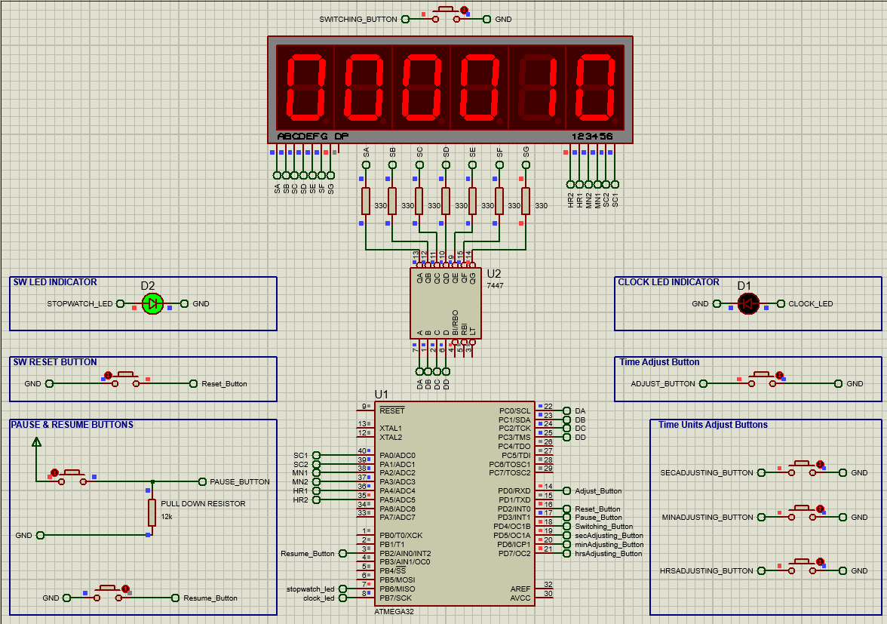

# MicroTick

MicroTick is a digital clock and stopwatch project implemented using the Atmega32 Microcontroller. It utilizes Timer1, interrupts 0, 1, and 2, as well as six multiplixed seven-segment display with a decoder, control push buttons, and indicator LEDs.

## Description

MicroTick is designed to provide a versatile timekeeping solution with the following features:

-   Digital Clock: The project includes a real-time clock (RTC) functionality that displays the current time on a seven-segment display. The clock is driven by the Atmega32 microcontroller and utilizes Timer1 for precise timekeeping.
    
-   Stopwatch: MicroTick also acts as a stopwatch, allowing users to start, stop, and reset the timer. The stopwatch functionality is implemented using interrupts 0, 1, and 2, enabling accurate timing measurements.
    
-   User Interface: The project includes control push buttons that enable users to interact with the clock and stopwatch.
buttons are used to set the time, start/stop the stopwatch, and perform other functions
Switch Button is used to switch between the normal watch/digital clock mode and the stopwatch mode.
Additionally, in the normal mode, you can use the respective buttons to adjust and change the time units. To adjust the time, enter the normal mode, press the adjust button to enable time changing, modify the time units using the respective buttons, and finally save the updated time by pressing the adjust button again.
In the Stopwatch mode you can start,stop and reset the time using the respective buttons

    
-   Seven-Segment Display: A seven-segment display with a decoder is used to showcase the time and stopwatch values. The display is multiplexed to efficiently cycle through the digits and show the current time or stopwatch value.
    

## Hardware Requirements

-   Atmega32 Microcontroller
-   Seven-Segment Display
-   7447 Decoder
-   Control Push Buttons
-   LEDs
-   Crystal Oscillator (for precise timer operation)
-   Supporting circuitry (resistors, capacitors, etc.)

## Usage

1.  Connect the necessary hardware components to the Atmega32 microcontroller based on the provided schematic and pin configuration.
2.  Compile the source code using the AVR-GCC compiler.
3.  Program the microcontroller with the generated HEX file using  any compatible programming tool.
4.  Power on the system and use the switching button to toggle between the normal watch/digital clock mode and the stopwatch mode.
5.  In the normal mode, press the adjust button to enable time changing. Use the corresponding buttons to adjust the time units (hours, minutes, seconds). After modifying the desired time units, press the adjust button again to save the updated time.
6.  In the stopwatch mode, use the control push buttons to start, stop, and reset the stopwatch as needed.
7.  Indicator leds distinguish between the two modes.
8.  Observe the seven-segment display to view the current time or stopwatch value.

## Normal Mode

## StopWatch Mode

## Contributing

Contributions to MicroTick are welcome! If you have any suggestions, bug reports, or feature requests, please open an issue or submit a pull request on the project's GitHub repository.

